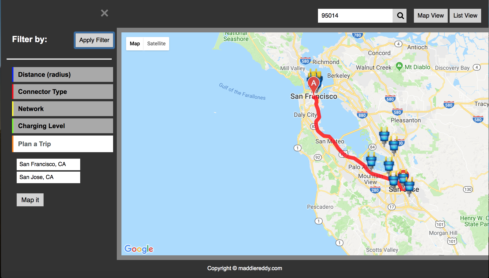

# PlugHubs
API Capstone project for Thinkful Full Stack Flex program

## Live Demo
https://maddiereddy.github.io/PlugHubs/

## What it does
Helps users locate electric vehicle charging stations geographically using the NREL API with Google Maps Javascript API

## Description
The app helps users find all the electric vehicle charging stations near them (using geolocation),   
or at an address or zip code that they can input.    
They have a choice of viewing the locations on the map as markers or as a list.    

The users can also filter the locations by    
	* radial distance (in miles)   
	* type of connector   
	* network   
	* charging levels    

The user needs to click on the 'Apply Filter' button to see the new search result.    

User can also plan a trip and view ev stations along the way.    
They would have to enter to and from locations, again as an address, city or zipcode and click on the 'Map it' button.    
Filter options can be applied as well.

NREL Request URLs used:    
  * GET /api/alt-fuel-stations/v1/nearest.json?parameters    
  * GET /api/alt-fuel-stations/v1/nearby-route.json?parameters    

## Technology used   
  * HTML
  * CSS
  * jQuery
  * http-server

## Instructions
To run app locally:
* git clone repository
* run `npm install` to install node-module packages
* run `npm run local` and app opens on localhost:8010

## Screenshots

Map View

List View

Filter and Plan a Trip menu

